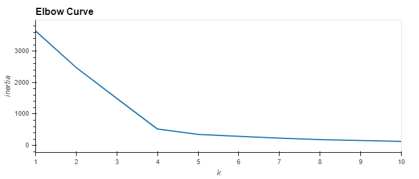
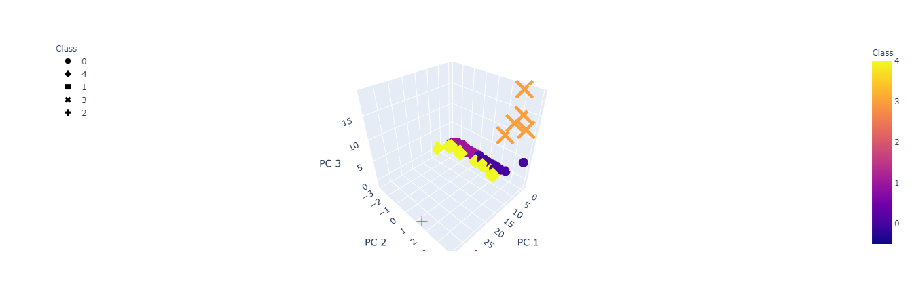
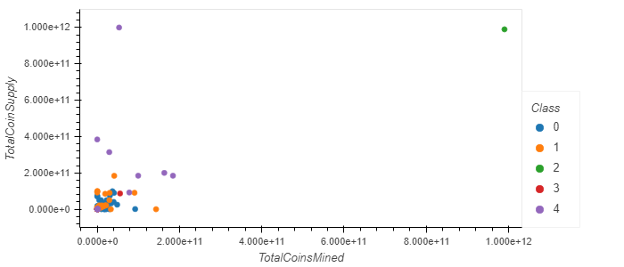

# AWS_cloud_homework_uw_fintech
  
## Summary
___
Overall, this PCA analysis will not stand the test on this crypto currency dataset, the 7% explained variance ratio missed the mark. Roughly 4 or 5 K-clusters were identified from these 3 PCAs.

Pulling the JSON data from cryptocompare.com seemed to work until it was compared to the data from the CSV file. TotalCoinSupply as a variable was notable missing in the JSON structure with MaxSupply being the closest in name. Ran both datasets, but struck with the CSV for purposes of this PCA homework exercise.

  

### ***Tidy Data frame for Crypto Currencies***
  CoinName | Algorithm | ProofType | TotalCoinsMined | TotalCoinSupply |
|----------:|----------:|----------:|----------------:|----------------:|
|   42 Coin |    Scrypt |   PoW/PoS |    4.199995e+01 |    4.200000e+01 |
|   404Coin |    Scrypt |   PoW/PoS |    1.055185e+09 |    5.320000e+08 |
| EliteCoin |       X13 |   PoW/PoS |    2.927942e+10 |    3.141593e+11 |
|   Bitcoin |   SHA-256 |       PoW |    1.792718e+07 |    2.100000e+07 |
|  Ethereum |    Ethash |       PoW |    1.076842e+08 |    0.000000e+00 |

  
### ***PCA Analysis (n = 3)***

|  CoinName |      PC 1 |      PC 2 |      PC 3 |
|----------:|----------:|----------:|----------:|
|   42 Coin | -0.325502 |  1.032442 | -0.540573 |
|   404Coin | -0.308875 |  1.032408 | -0.541095 |
| EliteCoin |  2.266633 |  1.628154 | -0.634583 |
|   Bitcoin | -0.161723 | -1.304247 |  0.170767 |
|  Ethereum | -0.151864 | -2.007156 |   0.34090 |

  
### ***Explained Variance Ratio***
PCA of 3 is not great for this dataset, more analysis is need. Total ratio is 7%, way under the advised ~80%

|       PC 1 |       PC 2 |       PC 3 |   |
|-----------:|-----------:|-----------:|--:|
| 0.02792875 | 0.02140453 | 0.02049662 |   |

  

### ***Elbow Curve to identify K clusters***
___

  

### ***Crypto Class Table***
___

  

### ***3D Scatter Plot with n = 5 clusters***
___

  

### ***2D Scatter Plot with n = 5 clusters***
___
